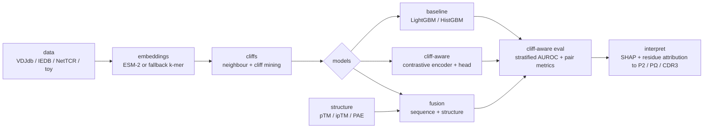

# tcr-cliff

**Activity-cliff-aware TCR–pMHC binding prediction with protein-language-model
embeddings and structural-confidence fusion.**

T-cell receptors (TCRs) can discriminate peptide–MHC (pMHC) ligands that differ by a
*single residue*: one peptide is recognised and triggers a response, its near-identical
neighbour is ignored. These **binding cliffs** are exactly the cases that matter
clinically — they govern neoantigen immunogenicity, off-target cross-reactivity of
engineered and bispecific T-cell therapies, and vaccine escape — yet they are precisely
where aggregate-optimised predictors fail. A model can post a strong overall AUROC while
being no better than a coin flip on the single-residue flips that decide safety.
`tcr-cliff` is built around this failure mode: it **mines binding cliffs and their smooth
neighbours**, trains a **cliff-aware contrastive model** that pulls smooth neighbours
together and pushes cliff pairs apart in embedding space, optionally **fuses
AlphaFold/ESMFold structural-confidence features** (pTM, ipTM, interface PAE), and then —
critically — **evaluates on the cliff stratum specifically**, reporting the cliff-record
AUROC, the overall-vs-cliff gap, cliff-pair directional accuracy, and cliff recovery.
The whole pipeline runs offline on a bundled synthetic toy set, and switches to real
VDJdb/IEDB/NetTCR data and ESM-2 embeddings with a one-line change.

---

## Architecture



The submodules are loosely coupled and the heavy optional dependencies
(`torch`, `fair-esm`, `transformers`, `lightgbm`, `shap`, `anarci`) are imported lazily,
so `import tcr_cliff` and the offline toy tests run on a minimal install.

---

## Quickstart

```bash
# Editable install with the dev toolchain (ruff, black, pytest, jupyter).
pip install -e '.[dev]'

# Optional heavy backends, installed only when you need them:
#   pip install -e '.[esm]'     # ESM-2 embeddings (fair-esm / transformers + torch)
#   pip install -e '.[torch]'   # cliff-aware contrastive model
#   pip install -e '.[boost]'   # LightGBM baseline (else sklearn HistGradientBoosting)
#   pip install -e '.[full]'    # everything, to reproduce the benchmarks
```

Everything below runs **offline on the bundled synthetic toy set** with the default
fallback embedder (no torch, no model downloads):

```bash
# 1. Mine binding cliffs and smooth neighbours; write cliffs.csv, cliff_stats.json,
#    and a cliff_graph.graphml you can open in Cytoscape / Gephi.
tcr-cliff find-cliffs --output runs/cliffs

# 2. Train a model (baseline by default; pass a config to select cliff-aware/fusion).
tcr-cliff train --output runs/baseline

# 3. The headline: cliff-aware evaluation on the held-out test split.
tcr-cliff eval --output runs/baseline

# 4. Embed sequences to an .npy feature matrix (for your own downstream models).
tcr-cliff embed --output runs/features

# 5. Explain a baseline prediction: SHAP field blocks + per-residue attribution.
tcr-cliff explain --output runs/explain
```

To run on **real data**, point `--config` at a config whose `embedding.backend` is
`esm-hf` (or `esm-fair`) and whose `data` source loads VDJdb/IEDB/NetTCR (see
[`DATASETS.md`](DATASETS.md)); no code changes are required.

---

## Benchmark (placeholder)

Numbers below are **placeholders** — fill them in after running the full pipeline on a
real benchmark split. The synthetic toy set must **not** be used for benchmark claims.
Columns mirror `tcr_cliff.eval.compare_models`: `overall_auroc`, `cliff_record_auroc`,
`auroc_gap` (non-cliff − cliff; smaller is better), `cliff_pair_dir_acc`, and
`cliff_recovery_rate`.

| Model       | Overall AUROC | Cliff-record AUROC | AUROC gap ↓ | Cliff-pair dir. acc. | Cliff recovery |
| ----------- | :-----------: | :----------------: | :---------: | :------------------: | :------------: |
| baseline    |     _TBD_     |       _TBD_        |    _TBD_    |        _TBD_         |     _TBD_      |
| cliff-aware |     _TBD_     |       _TBD_        |    _TBD_    |        _TBD_         |     _TBD_      |
| fusion      |     _TBD_     |       _TBD_        |    _TBD_    |        _TBD_         |     _TBD_      |

Reproduce with:

```bash
tcr-cliff train --config configs/baseline_lgbm.yaml --output runs/baseline
tcr-cliff train --config configs/cliff_aware.yaml   --output runs/cliff_aware
tcr-cliff train --config configs/fusion.yaml        --output runs/fusion
tcr-cliff eval  --config configs/baseline_lgbm.yaml --output runs/baseline
tcr-cliff eval  --config configs/cliff_aware.yaml   --output runs/cliff_aware
tcr-cliff eval  --config configs/fusion.yaml        --output runs/fusion
```

---

## Why cliffs?

A **binding cliff** is a pair of records whose varied sequence — the peptide *or* the
CDR3β — is within `k` edits (default a single substitution), while the *context* (the
non-varied entity and the MHC allele) is held fixed, but whose binding outcome
**differs**: a label flip and/or an affinity jump above a threshold. The matched control
is a **smooth neighbour**: equally close in sequence, but with the *same* outcome.

These pairs matter for three reasons:

1. **They are where prediction is hard and where it counts.** Aggregate AUROC is
   dominated by easy, well-separated pairs. A model can ace the overall metric while
   collapsing to chance on cliffs — and cliffs are exactly the single-residue flips that
   determine neoantigen immunogenicity, **bispecific / engineered-TCR off-target
   cross-reactivity**, and viral immune escape. `tcr-cliff` measures this directly: the
   cliff-record AUROC and the overall-vs-cliff **gap**.
2. **They are clean supervision.** A cliff pair differs in one residue but flips its
   label, so the residue *causing* the flip is pinned down. That is ideal signal for a
   **contrastive objective** (pull smooth neighbours together, push cliffs apart) and for
   **attribution** (which residue moved the prediction).
3. **They expose representation smoothness.** A naive embedding maps single-residue
   neighbours to nearly identical vectors, guaranteeing identical predictions and so
   guaranteeing cliff failure. The cliff-aware encoder is trained to be *locally
   non-smooth* exactly where biology is.

`tcr_cliff.cliffs.find_neighbor_pairs` mines both strata; `tcr_cliff.eval.cliff_aware_report`
turns them into the headline numbers; `tcr_cliff.interpret` maps per-residue importance onto
the canonical MHC-I anchor positions **P2** and **PΩ** (the peptide C-terminus) and the CDR3
loop.

---

## CLI reference

The console script `tcr-cliff` (entry point `tcr_cliff.cli.main:main`) is a
[Typer](https://typer.tiangolo.com/) app. Every command accepts an optional
`--config PATH` (a YAML `Config` dump; omit for built-in defaults) plus the common
overrides `--data`, `--output`, and `--seed`. Each command sets up logging and seeds RNGs
before calling the library.

| Command            | What it does                                                                                                                                |
| ------------------ | ------------------------------------------------------------------------------------------------------------------------------------------- |
| `tcr-cliff embed`        | Load pairs, build the embedding feature matrix (`build_feature_matrix`), and save `features.npy` + feature names to `--output`.        |
| `tcr-cliff find-cliffs`  | Mine neighbour/cliff pairs (`find_neighbor_pairs`); write `cliffs.csv`, `cliff_stats.json`, and `cliff_graph.graphml`.                 |
| `tcr-cliff train`        | Load + split data, `train_model`, then `model.save(<output>/model)`; detect cliffs on the test split and write predictions.            |
| `tcr-cliff eval`         | Load a saved model + test split, run `cliff_aware_report`, `save_report`, and print the headline stratified table.                     |
| `tcr-cliff explain`      | Load a baseline model, run `explain_baseline` (SHAP field blocks) + `residue_attribution`, and save importance plots.                  |

Run `tcr-cliff --help` or `tcr-cliff <command> --help` for the full option list.

---

## Citations

If you use this package, please cite the methods it builds on:

- **NetTCR-2.0** — Montemurro, A., Schuster, V., Povlsen, H. R., Bentzen, A. K.,
  Jurtz, V., Chronister, W. D., Crinklaw, A., Hadrup, S. R., Winther, O., Peters, B.,
  Jessen, L. E., & Nielsen, M. (2021). *NetTCR-2.0 enables accurate prediction of
  TCR-peptide binding by using paired TCRα and β sequence data.*
  **Communications Biology**, 4, 1060. https://doi.org/10.1038/s42003-021-02610-3

- **ESM-2** — Lin, Z., Akin, H., Rao, R., Hie, B., Zhu, Z., Lu, W., Smetanin, N.,
  Verkuil, R., Kabeli, O., Shmueli, Y., dos Santos Costa, A., Fazel-Zarandi, M.,
  Sercu, T., Candido, S., & Rives, A. (2023). *Evolutionary-scale prediction of
  atomic-level protein structure with a language model.*
  **Science**, 379(6637), 1123–1130. https://doi.org/10.1126/science.ade2574

- **AlphaFold2** — Jumper, J., Evans, R., Pritzel, A., Green, T., Figurnov, M.,
  Ronneberger, O., Tunyasuvunakool, K., Bates, R., Žídek, A., Potapenko, A., et al.
  (2021). *Highly accurate protein structure prediction with AlphaFold.*
  **Nature**, 596(7873), 583–589. https://doi.org/10.1038/s41586-021-03819-2

Dataset citations (VDJdb, McPAS-TCR, IEDB, NetTCR-2.0/ImmRep) and their licences are
listed in [`DATASETS.md`](DATASETS.md).

---

## License

`tcr-cliff` is free software released under the **GNU General Public License v3.0 or
later (GPL-3.0-or-later)**; see [`LICENSE`](LICENSE) for the full text. Every source file
carries an [SPDX](https://spdx.dev/) identifier as its first line:

```python
# SPDX-License-Identifier: GPL-3.0-or-later
# Copyright (C) 2026 tcr-cliff contributors
```
